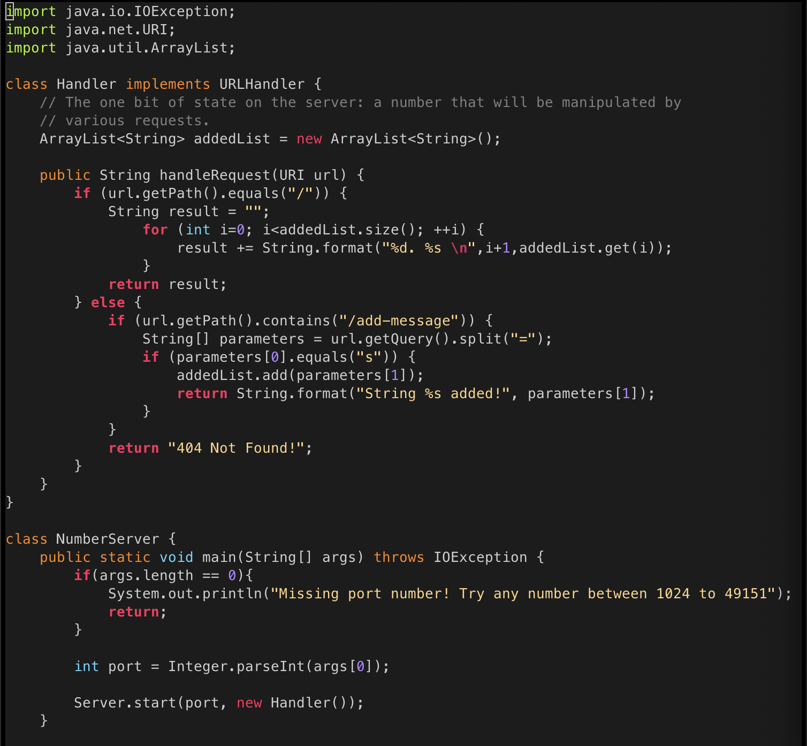
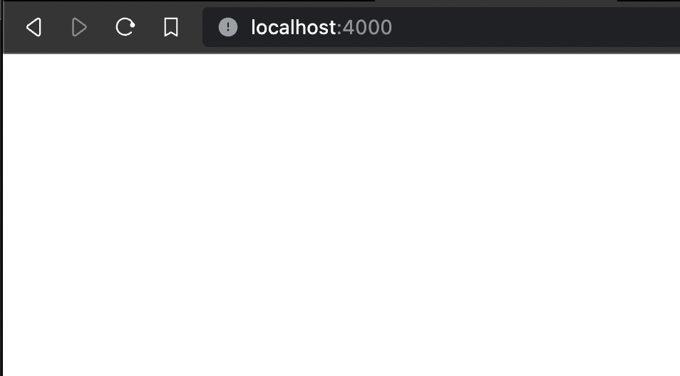
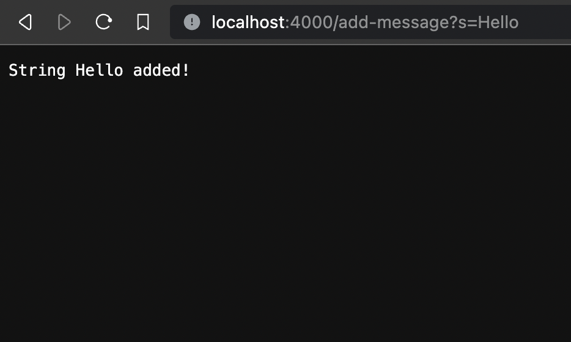
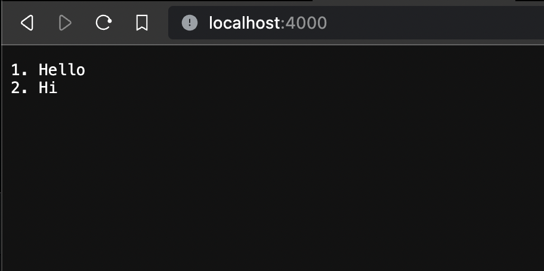
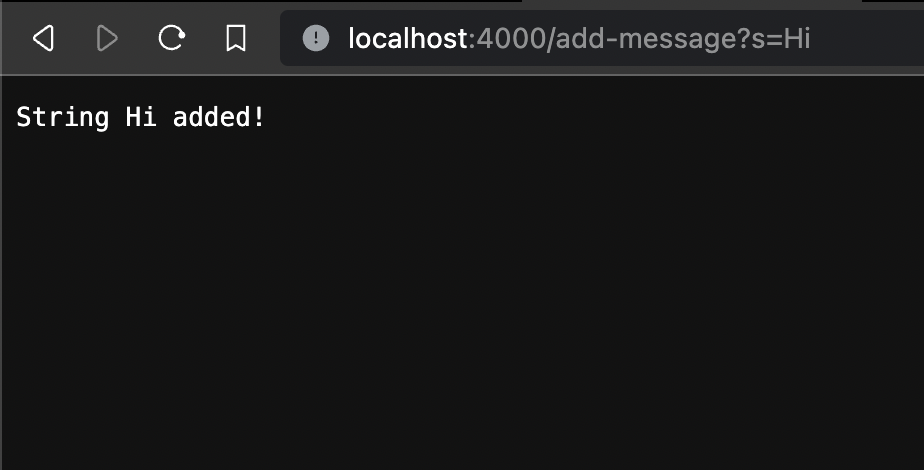
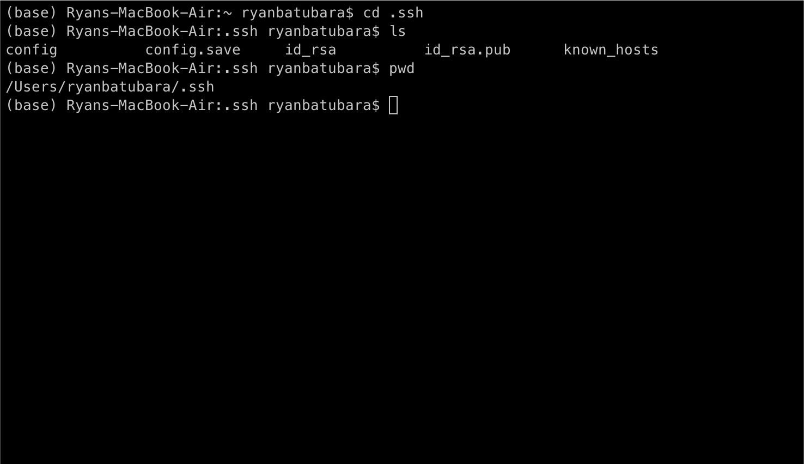
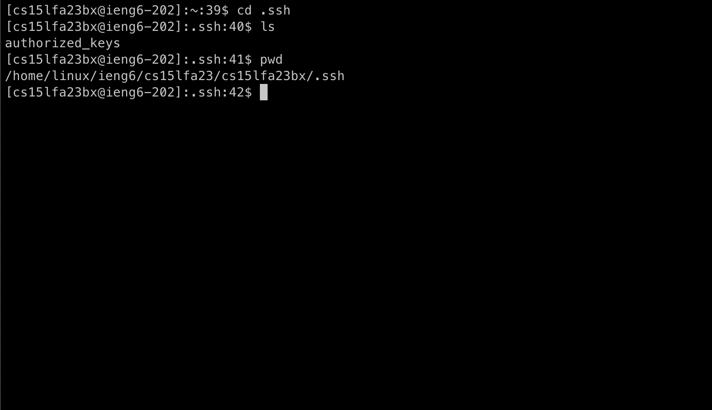
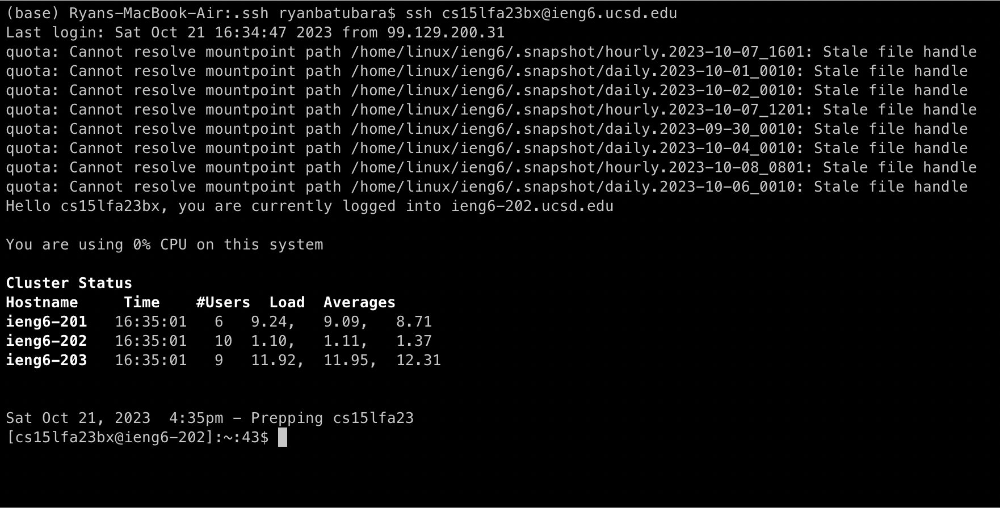

# Lab Report 1

## Part 1: String Server

Here is the code I wrote for the specified server:

Here is what the server looks like when starting up:

Here I add the string `Hi` using `\add-message` request:

1. Which methods in your code are called?
2. What are the relevant arguments to those methods, and the values of any relevant fields of the class?
3. How do the values of any relevant fields of the class change from this specific request? If no values got changed, explain why.

The result is as follows:

Here I add the string `Hello` using `\add-message` again:

1. Which methods in your code are called?
2. What are the relevant arguments to those methods, and the values of any relevant fields of the class?
3. How do the values of any relevant fields of the class change from this specific request? If no values got changed, explain why.

The result is as follows:

## Part 2

Here is the path to my private SSH key for logging into ieng6:

Here is the path to my public SSH for logging into ieng6 in my account on ieng6:

Here is me logging into my ieng6 account without being asked a password:

## Part 3

One thing I learned a lot about from Week 2 was making web servers in Java. \
I learned the basics of how to parse a url into requests in Java, as well as what happens when this breaks down. \
In addition, I learned a bit about what ports mean and why compiling `java NumberServer.java 4000` does not work if something is already using port 4000.
