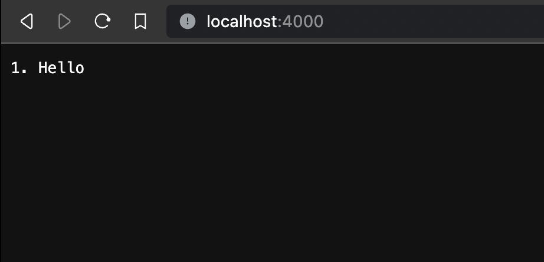

# Lab Report 1

## Part 1: String Server

Here is the code I wrote for the specified server:

Here is what the server looks like when starting up:

Here I add the string `Hi` using `\add-message` request:

1. The method `handleRequest` is called.
2. The method takes in the URL as an argument, and then modifies the addedList field.
3. First, the URL changes. Specifically, `url` now contains `"/add-message"` and so the string `"Hello"` right of the `=` gets added to the end of the addedList ArrayList using .add().

The result is as follows:

Here I add the string `Hello` using `\add-message` again:

1. The method `handleRequest` is called.
2. The method takes in the URL as an argument, and then modifies the addedList field.
3. First, the URL changes. Specifically, `url` now contains `"/add-message"` and so the string `"Hi"` right of the `=` gets added to the end of the addedList ArrayList using .add().

The result is as follows:

## Part 2

Here is the path to my private SSH key for logging into ieng6:

Here is the path to my public SSH for logging into ieng6 in my account on ieng6:

Here is me logging into my ieng6 account without being asked a password:

## Part 3

One thing I learned a lot about from Week 2 was making web servers in Java. \
I learned the basics of how to parse a url into requests in Java, as well as what happens when this breaks down. \
In addition, I learned a bit about what ports mean and why compiling `java NumberServer.java 4000` does not work if something is already using port 4000.
