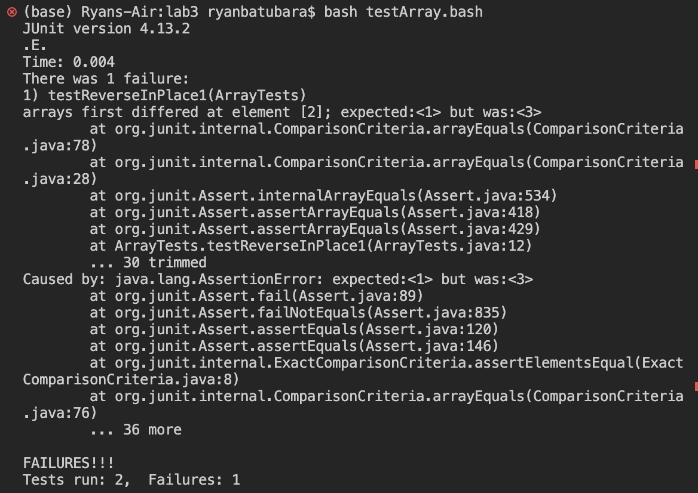

# Lab Report 3

## Part 1: Bugs

Here is a JUnit test that shows how the input array `input1 = [1,2,3]` 
into `ArrayExamples.reverseInPlace()` leads to a failure:
```
@Test 
public void testReverseInPlace() {
  int[] input1 = {1,2,3};
  ArrayExamples.reverseInPlace(input1);
  assertArrayEquals(new int[]{3,2,1}, input1);
}
```

Here is a JUnit test that shows how the input array `input1 = [1]` 
into `ArrayExamples.reverseInPlace()` leads to the correct output:
```
@Test
public void testReverseInPlace2() {
  int[] input1 = {1};
  ArrayExamples.reverseInPlace(input1);
  assertArrayEquals(new int[]{1}, input1);
}
```

Here are the symptoms of the bug described by running the tests:


Here is the original implementation of `reverseInPlace()`:
```
static void reverseInPlace(int[] arr) {
  for(int i = 0; i < arr.length; i += 1) {
    arr[i] = arr[arr.length - i - 1];
  }
}
```
Here is the corrected implementation of `reverseInPlace()`:
```
static void reverseInPlace(int[] arr) {
  int temp = 0;
  for(int i = 0; i < arr.length / 2; i += 1) {
    temp = arr[i]
    arr[i] = arr[arr.length - i - 1];
    arr[arr.length - i - 1] = temp;
  }
}
```
There are two key fixes here. 
First, notice that the issue with the first code is that the values of the 
first half of the array are completely overwritten and this leads to the 
bug shown in the tests. \
This can be fixed by storing the value in a `temp` variable, and then 
swapping the values of `arr[i]` and `arr[arr.length - i - 1]`. However, 
by swapping it like this, we effectively only need to exercute the loop
`arr.length/2` times, and so we modify the loop condition as well.

## Part 2: Researching Commands

I choose to research the `grep` command. \
I got the following information exclusively from running `man grep` on my ternminal.

### Option 1: `-i`

First, I learned about `-i` which makes grep case insensitive. This means that `grep`,
given an input string, will search for all such strings in a given path regardless
of whether the letters are capitalized or not. The two examples below show this is useful
if we don't know the precise capitalization for a name, but know how it is spelled:
<code>
(base) Ryans-Air:docsearch ryanbatubara$ grep -r "jstor" technical/plos
(base) Ryans-Air:docsearch ryanbatubara$ grep -ir "jstor" technical/plos
technical/plos/journal.pbio.0020010.txt:        JSTOR is successful for reasons its founders did not intend. Bill Bowen's inspired
technical/plos/journal.pbio.0020010.txt:        electronic format. Few libraries have discarded the volumes digitised in JSTOR, but many
technical/plos/journal.pbio.0020010.txt:        important journal runs JSTOR has digitised. Paper holdings have not decreased dramatically,
technical/plos/journal.pbio.0020010.txt:        As an access service, JSTOR is a creation of its time. Understandable though the
technical/plos/journal.pbio.0020010.txt:        retrospective. When we reach that point, JSTOR will still have a valued place in the
technical/plos/journal.pbio.0020010.txt:        content on offer, but it is difficult to see JSTOR providing thousands rather than a few
technical/plos/journal.pbio.0020010.txt:        readers. As the number of journal articles accessible over the networks increases, JSTOR
technical/plos/journal.pbio.0020010.txt:        Roger Schonfeld ends his very detailed description of JSTOR with a chapter on ‘Lessons
technical/plos/journal.pbio.0020010.txt:        ensure long-term economic viability. JSTOR has achieved that transition, and its success
technical/plos/journal.pbio.0020010.txt:        provides a model for others. Much of the credit must go to JSTOR's enterprising president,
technical/plos/journal.pbio.0020010.txt:        which could have resulted in JSTOR's reaching a deadend—and convinced the library and
technical/plos/journal.pbio.0020010.txt:        JSTOR's public image is of quality in depth—long runs of core journals—and that image has
technical/plos/journal.pbio.0020010.txt:        It is understandable that some mistakes were made on the way. The difficulty that JSTOR
technical/plos/journal.pbio.0020010.txt:        improved JSTOR's financial position in the short-term, consortia are a route to spreading
technical/plos/journal.pbio.0020010.txt:        adaptation of the JSTOR purchasing model for selling outside the United States, the United
technical/plos/journal.pbio.0020010.txt:        countries would have valued access to JSTOR earlier, but the approach to non-US deals had
technical/plos/journal.pbio.0020010.txt:        Roger Schonfeld's book draws out many of the significant points about JSTOR's place in
technical/plos/journal.pbio.0020010.txt:        to JSTOR as it is today. There is so much detail in the book that the reader may feel that
technical/plos/journal.pbio.0020010.txt:        by my institution, University College London, in joining JSTOR before the JISC deal was
technical/plos/journal.pbio.0020010.txt:        that outside the United States, as well as within, the early interest in JSTOR came from
technical/plos/journal.pbio.0020010.txt:        Leaving aside quibbles and caveats about the book and about JSTOR, this remains a
technical/plos/journal.pbio.0020010.txt:        has not gone away in the ten years since JSTOR was conceived, but the ultimate solution—the
technical/plos/journal.pbio.0020010.txt:        availability of electronic content—has become closer, and JSTOR's success has encouraged
<code>

```
(base) Ryans-Air:docsearch ryanbatubara$ grep -r "macfarlane" technical/plos
(base) Ryans-Air:docsearch ryanbatubara$ grep -ir "macfarlane" technical/plos
technical/plos/journal.pbio.0020112.txt:        Mountains of the Mind , Robert Macfarlane writes: ‘[F]or the hunter risk
```

### Option 2: `-A`

I also learned about `-A`, which takes in a number of additional lines
to print after a successful find. This is useful to get more context 
about precisely what you are searching means, as demonstrated in the 
two examples below:
```
(base) Ryans-Air:docsearch ryanbatubara$ grep "PLoS" technical/plos/pmed.0020090.txt 
        PLoS Medicine , John Danesh and colleagues from the University of
(base) Ryans-Air:docsearch ryanbatubara$ grep -A3 "PLoS" technical/plos/pmed.0020090.txt 
        PLoS Medicine , John Danesh and colleagues from the University of
        Cambridge, along with investigators from the Icelandic Heart Association, report the single
        largest prospective study addressing the role of uric acid in heart disease. Further, their
        systematic review combines their findings with those of 15 previously published prospective
```

```
(base) Ryans-Air:docsearch ryanbatubara$ grep -A5 "Saccharomyces" technical/biomed/1471-2091-3-23.txt
        Saccharomyces cerevisiae , a
        six-protein origin recognition complex binds to ARS
        consensus sequence (ACS) in a sequence specific manner [ 6
        ] . Individual ORC subunits have not been demonstrated to
        show DNA binding activity 
        in vitro . Recently, in an 
--
        Saccharomyces pombe ORC4 subunit has
        been reported to contain DNA binding activity by using its
        N-terminal AT hook region [ 8 ] . Neither ScCdc6 nor SpORC4
        showed any sequence specific DNA binding activity.
        Recombinant six protein 
        Drosophila ORC (DmORC) binds to ACE
```

### Option 3: `-B`

I also learned about `-B`, which is the counterpart to `-A`, as it 
takes a number of lines to print before a successful search. This 
too is useful to get more context about what you're searching, 
as shown in the following two examples:
```
(base) Ryans-Air:docsearch ryanbatubara$ grep -B5 "mouse models" technical/biomed/1471-2156-2-1.txt
        Glaucomatous phenotypes have been observed in a number
        of mammalian species, including mice [ 7, 8, 9]. Mice can
        be clinically and histologically analyzed throughout the
        course of a disease and their genes can be altered to study
        the molecular framework underlying pathology [ 10]. As a
        consequence, mouse models are useful for identifying and
```

```
(base) Ryans-Air:docsearch ryanbatubara$ grep -B6 "vagueness" technical/911report/chapter-12.txt
                destructive power in the largest cities of the United States. In this sense, 9/11
                has taught us that terrorism against American interests "over there" should be
                regarded just as we regard terrorism against America "over here." In this same
                sense, the American homeland is the planet. But the enemy is not just "terrorism,"
                some generic evil.
            
            This vagueness blurs the strategy. The catastrophic threat at this moment in history
```

### Option 4: `-C`

I also learned about `-C`, which is basically the combination of 
`-A` and `-B` as it takes a number and prints that number of lines 
before and after a successful find. This is useful to get a complete 
context of what we're searching for, as seen in these two examples:
```
(base) Ryans-Air:docsearch ryanbatubara$ grep -C3 "alkalinity" technical/government/Env_Prot_Agen/ctf7-10.txt
upstream and outside the influence of the outfall, or with other
uncontaminated natural water (ground or surface water) or standard
dilution water having approximately the same characteristics
(hardness, alkalinity, and conductivity) as the receiving water.
Seasonal variations in the quality of receiving waters may affect
effluent toxicity. Therefore, the pH, alkalinity, hardness, and
conductivity of receiving water samples should be determined before
each use. If the test organisms have been cultured in water which
is different from the test dilution water, a second set of
--


4.
The measured pH, hardness and alkalinity of the aerated
water will be as indicated in Table 4.


--
To be adequate for general
laboratory use following dechlorination, the tap water is passed
through a deionizer and carbon filter to remove toxic metals and
organics, and to control hardness and alkalinity.


7.5
--


8.8.5.1
It is recommended that total alkalinity and total
hardness also be measured in the undiluted effluent test water,
receiving water, and the dilution water.
```

```
(base) Ryans-Air:docsearch ryanbatubara$ grep -C4 "overshadowed" technical/government/About_LSC/Special_report_to_congress.txt
Corporation. Over the past quarter century, LSC has helped millions
of low-income citizens solve important, sometimes life-threatening,
legal problems. Despite the success of LSC and its many
contributions to access to justice for low-income Americans, its
achievements are overshadowed by the fact that so many in our
society continue to suffer injustice and are unable to gain access
to a lawyer for critical legal assistance. Until all members of our
society are afforded that access, this promise of our government
will continue to be unfulfilled. LSC is committed to promoting a
```
