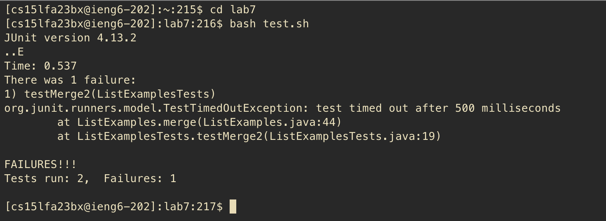
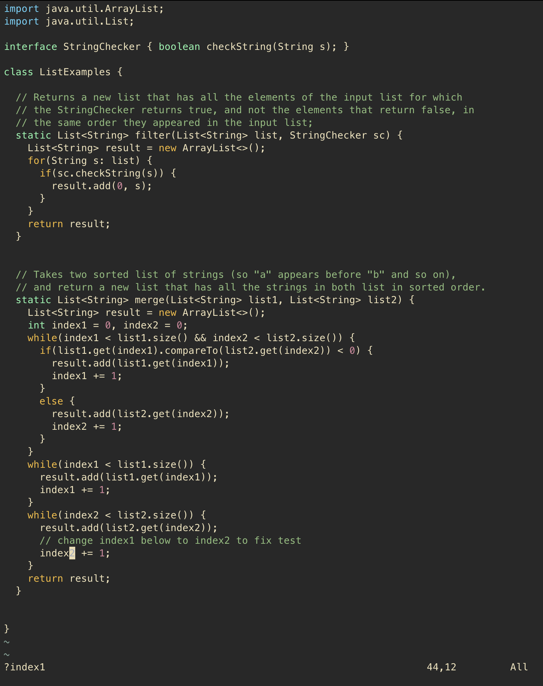
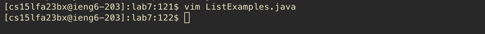

# Lab Report 4

## Step 4:

I input `ssh + <space> + cs15lfa23bx@ieng6.ucsd.edu + <enter>` to log in to ieng6. Here are some screenshots:

## Step 5:

I input `git + <space> + clone + <space> + git@github.com:rybplayer/lab7.git + <enter>` in order to clone my lab7 fork. This allows me to commit and push without having to log in. Screenshots:

## Step 6:

I then run the tests by first inputting `c + d + <space> + l + <tab> + <enter>` in order to quickly change into the lab7 directory. Then I input `bash + <space> + t + <tab> + <enter>` to run test.sh and see that the tests do fail. Screenshots:

## Step 7:

To edit the code, I first open the ListExamples.java file in vim with `vim + L + <tab> + . + j + <tab> + <enter>`. Here is a screenshot of the first open:

In order to change the last index1 to index2, I run the following: \
First I input `G` in order to get to the end of the file. Then I input `? + index1` to search for the first instance of index1 above, and hit `<enter>` to move the cursor there. \
Then I press `e` to go to the end of the word index1, before pressing `r + 2` to replace the 1 with a 2. Here is a screenshot of the change aready made:

Now that the fix has been made, I press `: + w + q + <enter>` in order quit and save the file, bringing me back to the terminal.

## Step 8:

Now to rerun the tests, I press `<up> + <up> + <enter>` to go back in my bash history and find the bash test.sh command. We see that the tests run without issue:

## Step 9:

Now to commit the changes, I first input `git + <space> + add + <space> + L + <tab> + .j + <tab> + <enter>`. Then I do `git + <space> + commit + <space> + -m + <space> + "Updated ListExamples.java" + <enter>` to commit the change with the description "Updated ListExamples.java". I then do `git + <space> + push` to push the commit. Here is a screenshot of the entire process:

Now that everything is done, I type `exit + <enter>` to exit out of ssh.
