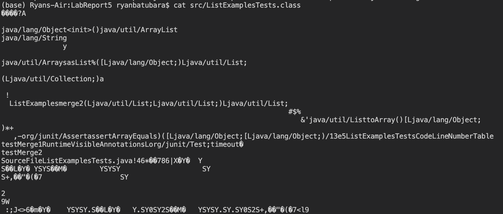
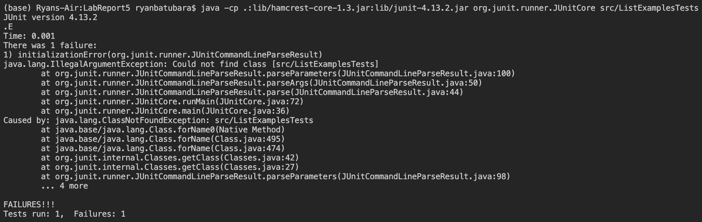

# Lab Report 5

## Part 1: Debugging

The following debugging scenario is loosely inspired by my personal experience in a lab earlier this quarter.

### A student makes the following private EdStem post regarding running tests for `ListExamples.java`:

Hello, I am really confused as to why my test.sh bash script isn't working. I am trying to run JUnit tests in `ListExamplesTests.java` to test the provided implementation of `filter()` and `merge()` in `ListExamples.java`, with the following directory structure:

Here is the bash script I am working with:

Here is the output I get when I try to run it:

Here is what I have tried to debug the scenario. The error says `java.lang.IllegalArgumentException: Could not find class [src/ListExamplesTests]` so the first thing I thought of was to check if the file `src/ListExamples` even exists. I did by checking if the file is listed when I do `ls` and if I can `cat` the file and get some confirmation of the file containing something:

Knowing the file exists with `ls`, and that `cat` can reach it, I tried running `java -cp .:lib/hamcrest-core-1.3.jar:lib/junit-4.13.2.jar org.junit.runner.JUnitCore src/ListExamplesTests` hoping to get some confirmation of the file existing, but instead got this:

I'm very confused; how can other bash commands like `ls` or `cat` tell me something exists at that path, but `java` could not? Could course staff please help?

### A TA writes the following response:

The issue you're experiencing is less of a mistake on your part, but a limitation of the `java` command.
Try `cd` into `src` and compiling and running the tests from there, directly calling the file name rather than its relative path from your main directory.
What do you notice? Do the errors still persist? What specifically did you change by moving into the `src` directory?
Think about what you changed, and how this might be related to how `java` interprets relative paths, or paths in general.

### The student gives the following response:

Thank you for the quick response. You're right, when I `cd src` and try to run `java -cp .:../lib/hamcrest-core-1.3.jar:../lib/junit-4.13.2.jar org.junit.runner.JUnitCore ListExamplesTests`, changing both the classpath (by adding `../` to the start of both paths) and the path of the file to be run (from `src/ListExamplesTests` to `/ListExamplesTests`) I get a successful test run:

This has allowed me to narrow down the bug causing the symptom to two things: either something is wrong with having my classpath at `lib/` but not at `../lib/`, or something is wrong when trying to call `java` on `src/ListExamplesTests` rather than `ListExamplesTests`. The first potential bug doesn't make sense, since in lecture we know that we can really put the lib files anywhere, as long as they are properly referenced. Therefore, I conclude the bugs is with `java` not behaving well with `src/ListExamplesTests`.

My guess then is that running `java -cp .:lib/hamcrest-core-1.3.jar:lib/junit-4.13.2.jar org.junit.runner.JUnitCore src/ListExamplesTests`, or more generally, any `java /path/file` causes Java to look for a file with the name `src/ListExamplesTests` or `path/file`, rather than going into the directory `src/` or `path/`, and checking if the files `ListExamplesTests` or `file` exists in those directories, respectively.

This guess is consistent when I try to run other Java files, such as `java src/ListExamples` or `java ListExamples`, or other Java files from previous labs. Thus, I have decided to move my bash script into the folder, and modify it to have the following contents:

Running the new file works! Thank you!

### Information about the setup

The above debugging scenario is based off the fact that `java` cannot accept path arguments for the file to run. That is, the command must be executed in the same directory as some `file`, as passing some `path/file` into Java will instead make it look for a file named `path/file` rather than look if there exists a `file` in the directory `path/`. 

More specifically, the symptom the student experienced, namely the `java.lang.IllegalArgumentException: Could not find class [src/ListExamplesTests]` was a result of a bug on line 6 of `test.sh` which called `java` on a path `src/ListExamplesTests`.

In the beginning, the following file structure was present:

This of course induced the above symptoms, and caused the student to rewrite `test.sh` and move it into `src/` as below:

The contents of each file before fixing the bug are as follows:

The directory `lib` contained two files, `hamcrest-core-1.3.jar` and `junit-4.13.2.jar`, both of which are Java `jar` files that contain the libraries necessary to import and use JUnit tests.

The directory `src` contains all of the relevant Java files:
- `ListExamples.java`, which is a working implementation of `filter()` and `merge()`, as seen earlier in class, and is screenshotted here: . `ListExamples.class` is the Java compiled `.class` version of `ListExamples.java`'s `ListExamples` class, while `StringChecker.class` is Java's compiled `.class` version of `ListExamples.java`'s `StringChecker` interface.
- `ListExamples.java`, which is a working test of `ListExamples.java` using JUnit, as seen earlier in class, and is screenshotted here: . `ListExamplesTests.class` is the Java compiled `.class` version of `ListExamplesTests.java` and is the main subject of the bug in the above debugging scenario.

In the beginning, `test.sh` was not in either folder, and had the following contents:

The bug could be triggered by running `test.sh`, which of course contained the command `java -cp $CLASSPATH org.junit.runner.JUnitCore src/ListExamplesTests`, which causes the bug. Here is a screenshot of this happening:

The bug could be fixed by executing `test.sh` and thus the `java` command in the same directory as `ListExamplesTests.class`, i.e. inside of `src`. So the student did three key steps:

1. First, move the `test.sh` file into `src`, for example by dragging the file icon of `test.sh` on the left menubar of VSCode into the `src` folder.
2. Then, the edit line 6 from `java -cp $CLASSPATH org.junit.runner.JUnitCore src/ListExamplesTests` to `java -cp $CLASSPATH org.junit.runner.JUnitCore ListExamplesTests`, since we are now in the same directory and thus a path is not necessary.
3. Finally, change the classpath bash variable from `CLASSPATH=".:lib/hamcrest-core-1.3.jar:lib/junit-4.13.2.jar"` to `CLASSPATH=".:../lib/hamcrest-core-1.3.jar:../lib/junit-4.13.2.jar"`, reflecting the change in relative paths to both library files, as we have moved from the main directory to `src`.

These changes create this new file sturcture:

The new `test.sh` is as follows:

This endd the description of the debugging scenario, as well as how to fix the bug.

## Part 2: Reflection

I found the whole concept of `jdb` to be the most interesting thing I have learned from the second half of CSE15L, and wished I learned it earlier. For the longest time, I have always inserted random `System.out.println()` statements in my code in order to debug and get a sense of what is going on. In my experience, most of the time I know roughly what line(s) a bug is present at from its symptoms. However, I am unable to understand why some failure-inducing input causes a failure, hence the need for `System.out.println()`.

With `jdb`, I can stop the program at that specific line, and check if the value of variables is what I expect from the program, or whether I have made an error somewhere. When we used it to check the length of `hashed` in `BCyrpt` in the last skill demo, I felt like that was the perfect example of how powerful `jdb` is.
